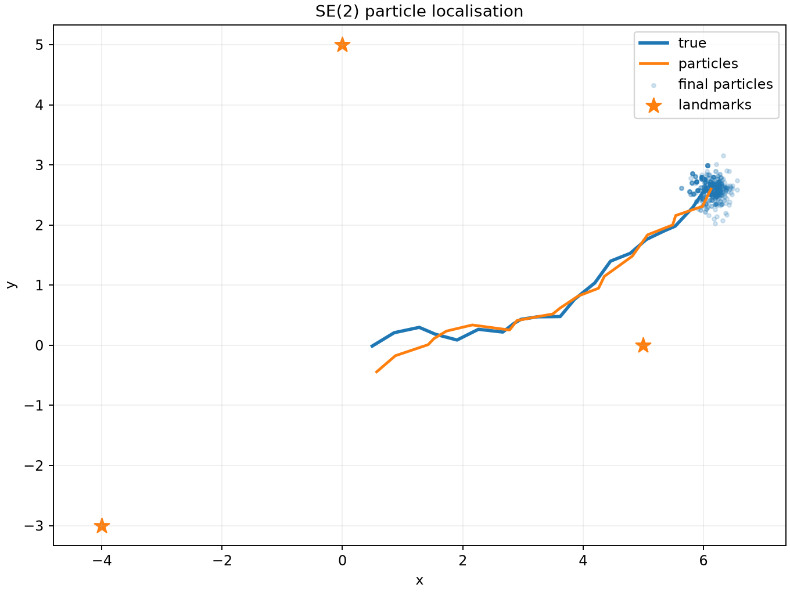

# SE(2) particle localisation

This example estimates the same kind of planar trajectory with a bootstrap
particle filter. It starts with 500 local samples, updates their weights from
landmark observations and resamples when effective sample size falls below half
the population.

```console
uv run python examples/particle_localisation.py
```

Save a plot with:

```console
uv run python examples/particle_localisation.py --plot particles.png
```



The displayed pose estimate uses weighted translation and a circular heading
mean. The particle cloud—not that summary—is the posterior representation.

??? example "Complete script"

    ```python
    --8<-- "examples/particle_localisation.py"
    ```

Continue with the [particle-filter guide](../guides/particle-filter.md) for ESS,
resampling policy and failure modes.
