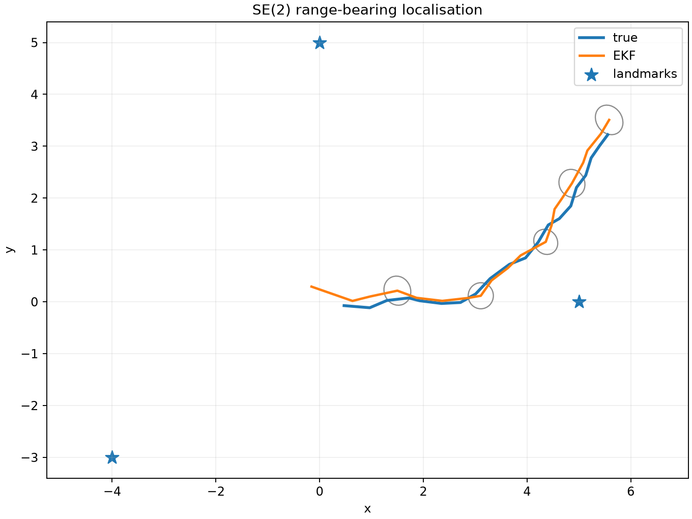

# SE(2) EKF localisation

This end-to-end example drives a planar robot on a curved path, simulates
range-bearing measurements to known landmarks and estimates the pose with the
manifold-aware EKF.

```console
uv run python examples/se2_localisation.py
```

It reports final poses, trajectory position RMSE and mean NEES. To save a plot:

```console
uv run python examples/se2_localisation.py --plot localisation.png
```



## What to notice

- The simulator and filter share the same state-space and model families.
- The true and estimated pose remain state arrays; covariance remains local to
  each estimated pose.
- `jax.lax.scan` performs the sequential filtering loop.
- Pose error uses `se2.local_coordinates`, not coordinate-wise subtraction.
- The plotted covariance ellipses are rotated from the body tangent frame into
  the world frame for display.

??? example "Complete script"

    ```python
    --8<-- "examples/se2_localisation.py"
    ```

Read the [EKF guide](../guides/extended-kalman-filter.md) for the algorithm and
[simulation guide](../guides/simulation-and-evaluation.md) for interpreting
RMSE and NEES.
